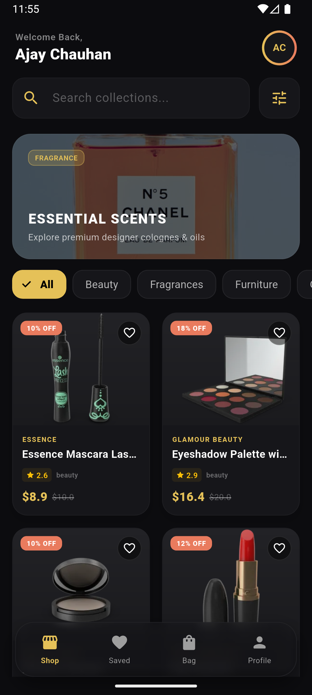
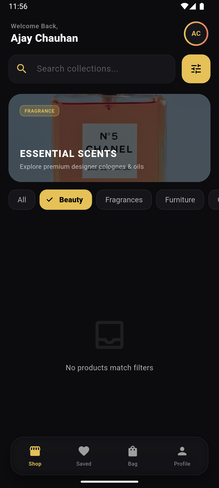

# 🛒 Luxe Shop - Premium E-Commerce Client & Assignment Submission

A world-class, production-ready e-commerce mobile application built with **Flutter**, structured in clean **MVVM (Model-View-ViewModel)** architecture, and styled using the **Midnight Champagne** luxury design system.

This repository contains the complete submission for the Flutter Developer Internship:
- **Part 1**: Production-grade E-Commerce Flutter Application (complete with caching, pagination, debounced searches, wishlist persistence, and cart management).
- **Part 2**: DSA Questions (solved optimally in Dart and Java).
- **Part 3**: Practical Coding Questions (solved in Dart, Java, and Flutter).

---

## 📱 Application Previews

| Home Screen | Product Detail |
| :---: | :---: |
|  |  |

### 🎥 Screen Recording Demo
Watch the 12-second screen recording showing our premium animations, smooth grid entry, and scrolling speed:
[assets/app_demo.mp4](assets/app_demo.mp4)

---

## 📸 Core UI Highlights & Features

1. **Midnight Champagne Design Language**: Highly customized dark palette (`#0C0C0F` / `#16161A`) accented with soft Champagne Gold (`#E5C158`) and Terracotta Coral (`#E97B5E`).
2. **Glassmorphic Floating Navigation**: Custom floating bottom bar with real Gaussian blur filters (`BackdropFilter`) and live notification badge indicators.
3. **Multi-Tab Dashboard**:
   - **Shop Gallery**: Category tags, search, and dynamic sliding promo banners.
   - **Saved Favorites**: Wishlisted products.
   - **Shopping Bag**: Real-time item additions, increments/decrements, total cost math, and mock checkout.
   - **User Profile**: Gold membership status and order shipment timeline.
4. **Physical Bounce Animation**: State-driven card scaling feedback (scales down to `0.95` on tap).
5. **Cascading Grid load**: Products slide and fade into view sequentially for a smooth visual entry.
6. **Offline-First Resilience**: Reads and displays local JSON caches instantly, fetching fresh updates in the background.

---

## 📂 Project Architecture & Structure

Our code strictly isolates UI widgets from business logic and data providers:

```text
lib/
├── models/
│   └── product.dart               # Type-safe model definition
├── services/
│   ├── api_service.dart           # HTTP calls with concurrent execution configurations
│   └── storage_service.dart       # Local SharedPreferences cache/wishlist persistence
├── viewmodels/
│   ├── product_list_vm.dart       # Manages catalog, search debouncing, pagination states
│   ├── wishlist_vm.dart           # Handles liked products logic
│   └── cart_vm.dart               # Manages shopping bag items, sums, and quantities
├── views/
│   ├── home_screen.dart           # Houses the 4 tabs and floating navigation bar
│   ├── detail_screen.dart         # Detail description pages, ratings, and checkout drawer
│   ├── wishlist_screen.dart       # Dedicated wishlist screen fallback template
│   └── widgets/
│       ├── product_card.dart      # Tap-bounce animated product card layout
│       ├── filter_sheet.dart      # Category selection chips and price range sliders
│       └── shimmer_loader.dart    # Custom soft wave shimmer loading blocks
```

---

## 📋 Part 2 & Part 3 Assignment Folders

All solutions for the DSA and practical coding questions are organized inside the `assignment/` directory:

- **[assignment/assignment_solutions.md](file:///Users/ajaychauhan/Downloads/product_app/assignment/assignment_solutions.md)**: Master document detailing solutions, algorithms, complexity analyses, and explanations.
- **[assignment/dsa/dsa_solutions.dart](file:///Users/ajaychauhan/Downloads/product_app/assignment/dsa/dsa_solutions.dart)**: Runnable Dart file containing solutions for:
  - Q1: Two Sum Variant ($O(N)$ hash-map solution).
  - Q2: Longest Substring Without Repeating Characters ($O(N)$ sliding window).
- **[assignment/practical/](file:///Users/ajaychauhan/Downloads/product_app/assignment/practical/)**:
  - `api_list_example.dart`: Flutter code template for API integrations.
  - `pagination_example.dart`: Flutter pagination logic via ScrollController.
  - `debounce_example.dart`: Reusable Dart debouncer utility class.
  - `StringReversal.java`: Java function to reverse a string without built-in methods.
  - `DuplicateFinder.java`: Java program to find duplicate elements in an array.

---

## ⚙️ How to Setup & Run

### Prerequisites
- Flutter SDK (v3.19.0 or higher)
- Android SDK / NDK configuration (v27.0.12077973 already configured in build gradle)

### Installation Steps
1. Clone the repository and navigate to the project directory:
   ```bash
   cd product_app
   ```
2. Clean the project and fetch packages:
   ```bash
   flutter clean
   flutter pub get
   ```
3. Run the static code analyzer (expected output: *No issues found!*):
   ```bash
   flutter analyze
   ```
4. Run the application:
   ```bash
   flutter run
   ```

---

## 📦 Production Builds (Release APK)
The compiled production release APK is located at:
- **`build/app/outputs/flutter-apk/app-release.apk`**
